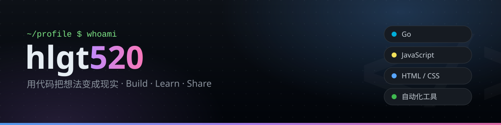
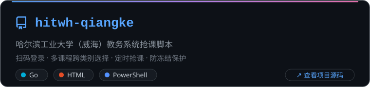

## 👨‍💻 关于我

- 🎓 就读于 **哈尔滨工业大学（威海）**
- 💻 主攻 **Go / JavaScript**，热爱后端开发与自动化工具
- 💡 擅长把生活与学习中的痛点，变成顺手的小工具
- ⚡ 信条：**让代码替人干活，把时间留给有趣的事**

## 🚀 精选项目

> 🌱 更多项目正在私有仓库中孵化中，敬请期待～

## 🛠 技术栈

## 📊 GitHub 数据

<picture>
  <source media="(prefers-color-scheme: dark)" srcset="https://raw.githubusercontent.com/hlgt520/hlgt520/output/github-snake-dark.svg"/>
  
</picture>

## 📫 联系我

<!-- 如需补充联系方式，可在此处添加邮箱 / 微信 / 博客等徽章（保持深色底 0d1117 风格统一） -->

如果我的项目帮到了你，欢迎点个 ⭐ **Star** ～

